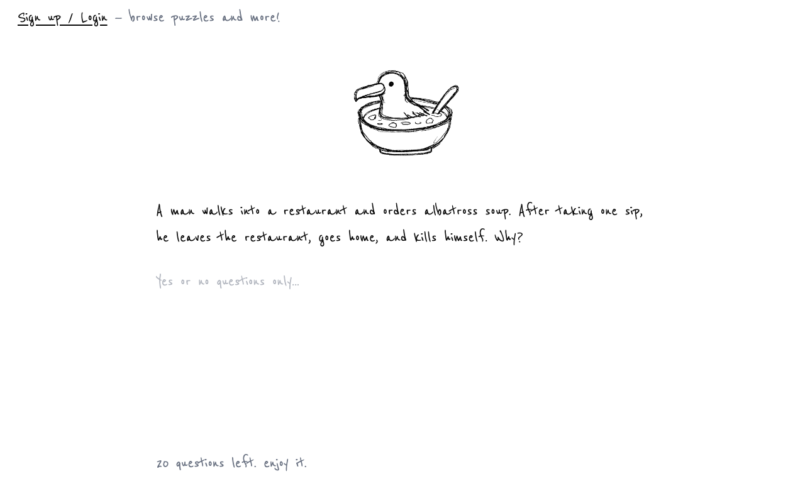

# Albatross

A lateral thinking puzzle game platform. Play it at [playalbatross.com](https://www.playalbatross.com/).



## How it works

Each round starts with a strange, unexplained scenario — a man orders albatross soup at a restaurant, takes one sip, then goes home and ends his life. *Why?*

Your job is to figure out what really happened by asking yes/no questions:

- An AI judge answers each question **yes**, **no**, **not relevant**, or **invalid**, with a short rationale.
- You have **20 questions** per puzzle.
- At any point you can switch to **guess mode** and submit your full theory. The AI rates it as **correct**, **close**, or **off track**.
- The round ends when you solve it, run out of questions, or reveal the solution.

Beyond the daily puzzle on the homepage, the in-app menu has tabs for **Browse** (puzzles created by other players), **Create** (an AI-assisted puzzle generator), **My Puzzles**, and **Profile**.

## About lateral thinking puzzles

Lateral thinking puzzles — also called **situation puzzles** or **minute mysteries**, and famously known in Japan as **ウミガメのスープ** ("sea-turtle soup") — are short, mysterious scenarios solved by asking the host yes/no questions. The "albatross soup" puzzle on the homepage is one of the genre's most iconic examples, and the project's namesake.

The term *lateral thinking* was coined by **Edward de Bono** in his 1967 book *The Use of Lateral Thinking*: solving problems by stepping sideways out of the obvious chain of reasoning rather than drilling down logically. **Paul Sloane** later popularized the yes/no-question puzzle format with *Lateral Thinking Puzzlers* (1991) — the format Albatross uses, with an AI standing in for the human host.

### Further reading

- Wikipedia — [Situation puzzle](https://en.wikipedia.org/wiki/Situation_puzzle)
- Wikipedia — [Lateral thinking](https://en.wikipedia.org/wiki/Lateral_thinking)
- Wikipedia — [Edward de Bono](https://en.wikipedia.org/wiki/Edward_de_Bono)
- [Paul Sloane's Lateral Puzzles](https://www.lateralpuzzles.com/)

## Stack

- **Framework**: Next.js (App Router)
- **Language**: TypeScript
- **Styling**: Tailwind CSS v4 + shadcn/ui
- **Linter/Formatter**: Biome
- **Database**: Supabase (Postgres)
- **AI**: Vercel AI SDK

## Getting Started

```bash
# Install dependencies
pnpm install

# Fill in your env vars
cp .env.local.example .env.local
$EDITOR .env.local

# Start Supabase locally
npx supabase start

# Apply migrations and seed data
npx supabase db reset

# Start the dev server
pnpm dev
```

## Environment Variables

| Variable | Description |
|----------|-------------|
| `NEXT_PUBLIC_SUPABASE_URL` | Your Supabase project URL |
| `NEXT_PUBLIC_SUPABASE_ANON_KEY` | Your Supabase anon/public key |
| `VERCEL_AI_GATEWAY_API_KEY` | API key for Vercel AI Gateway |

Fill in your values in `.env.local`.

## Scripts

| Command | Description |
|---------|-------------|
| `pnpm dev` | Start development server |
| `pnpm build` | Build for production |
| `pnpm format` | Format code with Biome |
| `pnpm lint` | Lint code with Biome |
| `pnpm typecheck` | Run TypeScript type checking |
